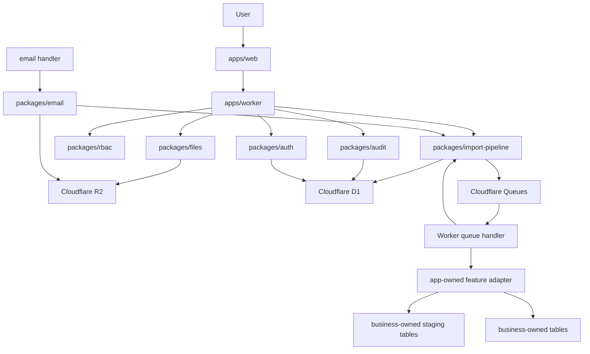

# qitu Architecture Overview

Status: draft  
Date: 2026-06-27

## 1. Purpose

`qitu` is a reusable application foundation for Cloudflare-first fullstack systems.

It is designed for products that need:

1. Users and permissions.
2. File ingestion.
3. Human review.
4. Auditability.
5. Async jobs.
6. Email.
7. AI assistance with human control.
8. A coherent app shell and design system.

It is intentionally business-neutral.

## 2. Architecture Shape



## 3. Layers

### 3.1 Platform Layer

Cloudflare capabilities:

1. Workers for API.
2. Workers Static Assets or Pages for frontend.
3. D1 for relational state.
4. R2 for files and raw artifacts.
5. Queues for asynchronous processing.
6. Email Service / Email Routing for mail.
7. Workers Logs and observability for runtime debugging.

### 3.2 Implemented Core Package Layer

Reusable packages:

1. `auth`
2. `rbac`
3. `files`
4. `jobs`
5. `import-pipeline`
6. `audit`
7. `email`
8. `ai-advisory`
9. `ui`
10. `design-system`
11. `charts`
12. `config`
13. `db`
14. `testing`

Security events and alerts are planned capabilities. Keep them in `audit` or app-owned code until repeated production features prove they need separate packages.

### 3.3 Business Feature Layer

Business-owned feature code owns:

1. Parsers.
2. Business validation.
3. Staging table schema.
4. Business-owned tables.
5. Business-specific pages.
6. Business-specific charts and reports.
7. Deterministic calculations.

This code may live inside `apps/*`, `examples/*`, or a future feature/module directory. `qitu` does not require a top-level `domains/*` layout.

## 4. Core Flow

The most important reusable flow is:

```text
source file -> import job -> queue -> parse -> staging -> review -> commit -> audit
```

This flow should remain generic. Business-specific logic plugs into parse, validate, stage, and commit.

## 5. Design Principles

### 5.1 Business Neutrality

No core package should contain business terminology from a specific project.

### 5.2 Source First

Raw inputs are preserved before parsing.

### 5.3 Human Review Before Truth

Parsed data goes to staging before business-owned tables.

### 5.4 Audit By Default

Security-sensitive and business-sensitive operations write append-only events.

### 5.5 AI Is Advisory

AI may suggest, explain, or draft. It must not silently commit business truth.

### 5.6 Extract Late, Name Early

Use package-shaped folders early. Stabilize package APIs after a real vertical slice works.

## 6. First Vertical Slice

The first implementation slice should prove:

1. Invite user.
2. Register from invite.
3. Login.
4. Upload source file.
5. Save to R2.
6. Create `source_files`.
7. Create `import_jobs`.
8. Queue a job.
9. Parse with an app-owned starter import adapter.
10. Write staging records.
11. Review and approve.
12. Commit to a business-owned table.
13. Write audit events.

This validates the starter without depending on any real business.
